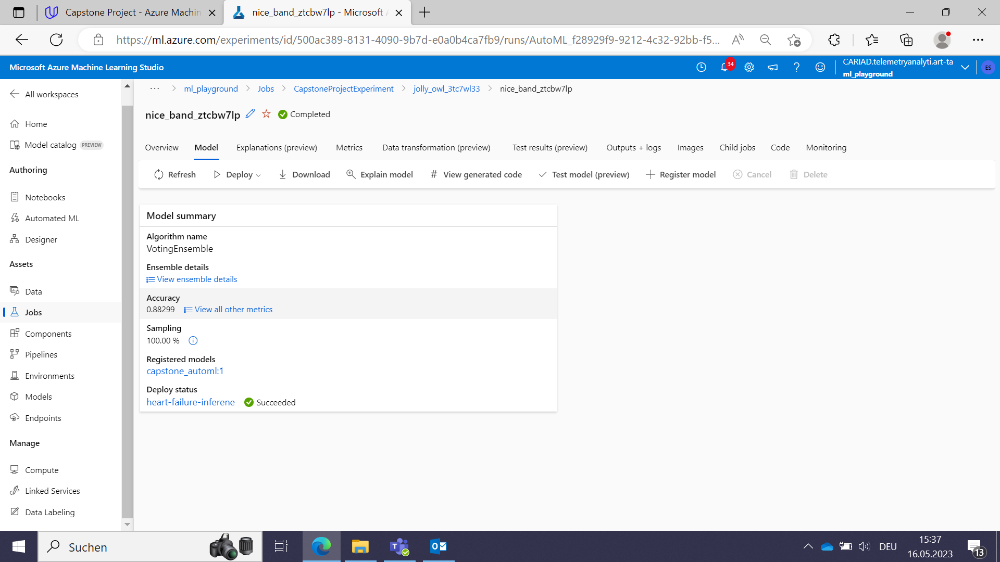
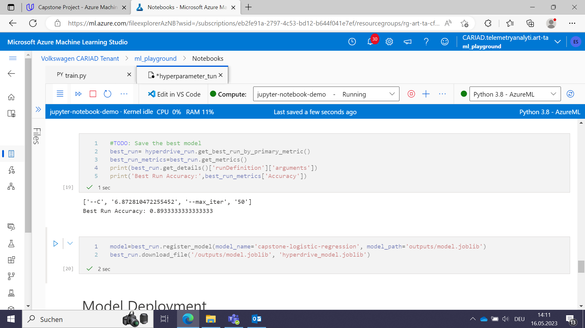
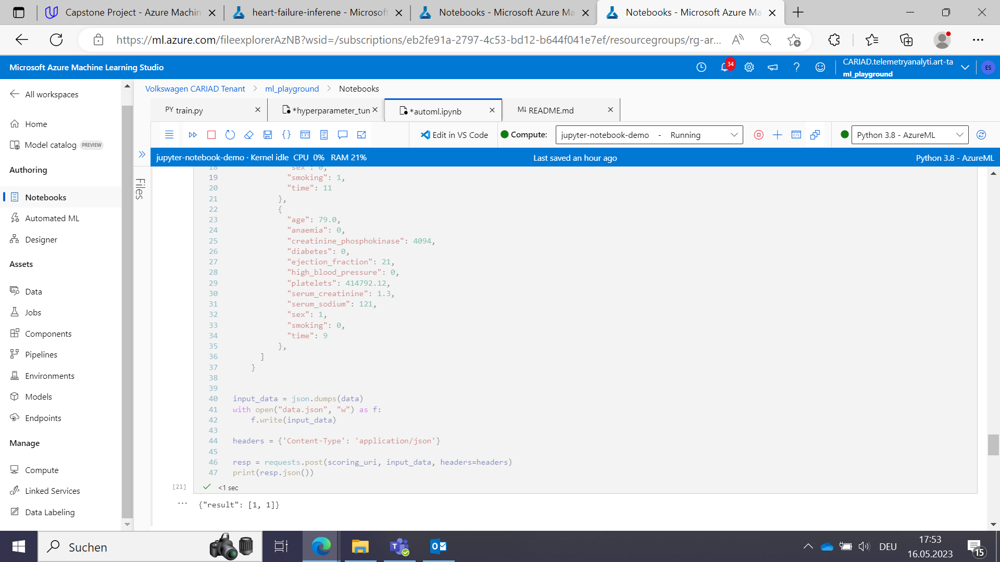

# Capstone Project udacity ML in Azure Nanodegree

This repo contains the code required for the Capstone Project for the udacity ML Engineer in Azure course.
The given task is to pick a dataset and a corresponding ML task and model with both the AutoML feature and the Hyperdrive Feature from Azure ML Studio.

## Dataset

I chose a very popular dataset from the UCI ML Repo, the [Cleveland Heart Disease Dataset](https://archive.ics.uci.edu/ml/datasets/Heart+Disease). (As a trained paramedic this topic is close to my heart :-)

### Overview
The dataset contains many non-invasive features and measurements and information about heart disease and heart failure/death of the patients. 

### Task
The obvious task for this dataset is to predict heart failure/death from the given features. In particular I used a reduced set of 14 features and a binary attribute, the death of the patient in a definded period of time.

### Access
To access the data I create a dataset from a preprocessed .csv containing features and label for about 300 patients.

## Automated ML
The main design decisions for the AutoML step were the following:
- "experiment_timeout_minutes": 15 Sets the time for the AutoML algorithm to a maximum of 15 minutes, the minimal possible value. I chose this because in this context I am more interested in the engineering part than the machine learning part and accuracy is not the main concern.
- "primary_metric" : 'accuracy' the metric to rank the diffent algorithms with
- task = "classification" the task AutoML is supposed to perform
- label_column_name="DEATH_EVENT" the label for the classification task
- enable_early_stopping= True allow the AutoML algorithm to terminate a run if the metric does not seem to be improving; enables the algorithm to cover more ground with relatively low risk
- featurization= 'auto' sets the featurization to automatic (Featurization encompasses steps esuch as feature normalization, handling missing data, or converting text to numeric)
                           
### Results
The best model turned out to be a voting ensemble with an accuracy of .88 This is on the one hand not surprising as ensembles quite often are the best choice but on the other hand has only limited value as very little time was given to search for the best model.

## Hyperparameter Tuning
As the task is a binary classification and in this context I am more interested in the engineering part and less the machine learning part I picked the most fundamental binary classification algorithm, the logistic regression. The hyperparameters to be tuned are the regularization constant "C" and the maximum number of iterations "max_iter".

### Results

The Hyperdrive algorithm found the pair ['--C', '6.872810472255452', '--max_iter', '50'] to provide the best accuracy of 0.893

 

## Model Deployment

Azure provides code examples for inference/scoring in the consume tab. Based on this I queried the Endpoint in the Jupyter Notebook.

## Screen Recording
The required screencast for this project can be found [here]
- A working model
- Demo of the deployed  model
- Demo of a sample request sent to the endpoint and its response

## References

For the code I relied on the Azure ML documentation and the first two projects in this nanodegree program and (re)used code snippets especially for the boilerplate part.